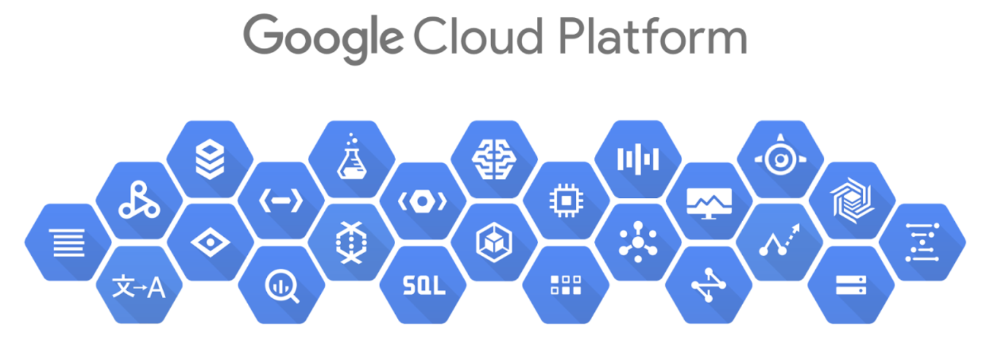

# Google Cloud Platform

## This workshop consists of multiple parts:
  * __Having an overview of Google Cloud Platform console and how to access the resources out there__
  * __Configuring local environment by installing GCP SDK locally so that you can create operations from the machine's terminal__
  * __Deploying an actual Spring Boot monolith application to the App Engine platform (PaaS)__
  * __Deploying a suite of services build with Spring Cloud to Compute Engine platform (IaaS)__

## Let's start with the basics:
  * Google Cloud Platform, offered by Google, is a suite of cloud computing services that runs on the same infrastructure that Google uses internally for its end-user products, such as Google Search and YouTube.

In particular, for this workshop, we're going to use:

* __Google App Engine__: Google App Engine enables you to build and host applications on the same systems that power Google applications. App Engine offers fast development and deployment; simple administration, with no need to worry about hardware, patches or backups; and effortless scalability.

* __Google Compute Engine__: Google Compute Engine offers scalable and flexible virtual machine computing capabilities in the cloud, with options to utilize certain CPUs, GPUs, or Cloud TPUs. You can use Google Compute Engine to solve large-scale processing and analytic problems on Google's computing, storage, and networking infrastructure.

## At the following links, you are provided with information that covers different topics. 

#### Beginning with the first one, you get to see an overview of GCP and how the console work, how the projects are being organized and where can you access your resources.

#### Second one shows you how to set up your environment in order to interact with GCP's services from a command line interface.

#### The third step is going to let you use an App Engine where you can deploy the monolith you created in Day 2.

#### Final step requires for you to use multiple instances of Compute Engine where you need to deploy the services created in Day 2, after the split of the monolith and test them using requests (i.e Postman).

  
  
  
  
