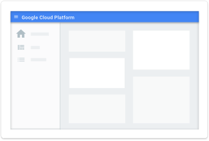
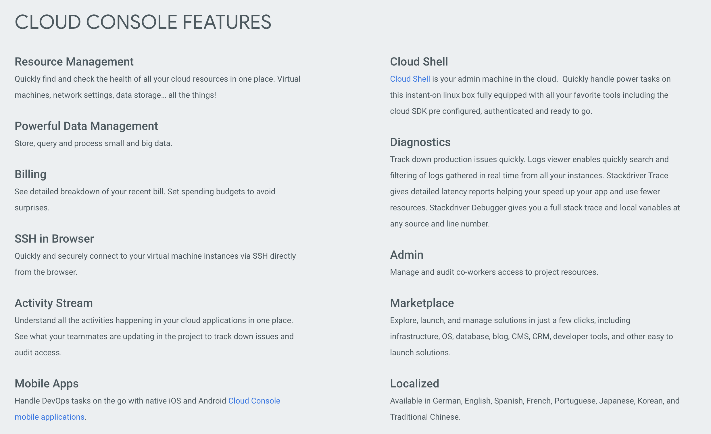

# GCP- Cloud Console Introduction

### Powerful Web Admin UI
Manage and get insights into everything that powers your cloud application -- including web applications, data analysis, virtual machines, datastore, databases, networking, and developer services. 

Google Cloud Console helps you deploy, scale and diagnose production issues in a simple web based interface. Search to quickly find resources and connect to instances via SSH in the browser. Handle devops workflows on the go with powerful native iOS and Android applications. Master the most complex development tasks with Google Cloud Shell, your admin machine in the cloud.

### Find and Manage Your Resources Quickly
Never be in doubt about your cloud resources. You can easily find your resources, check their health, have full management control over them, set budgets to control how much you spend on them.

(optional)Click on the video below for a quick overview on GCP Cloud Console.

