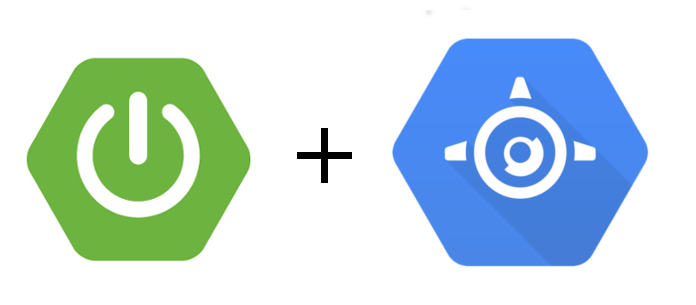
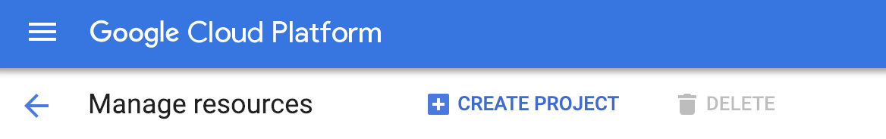
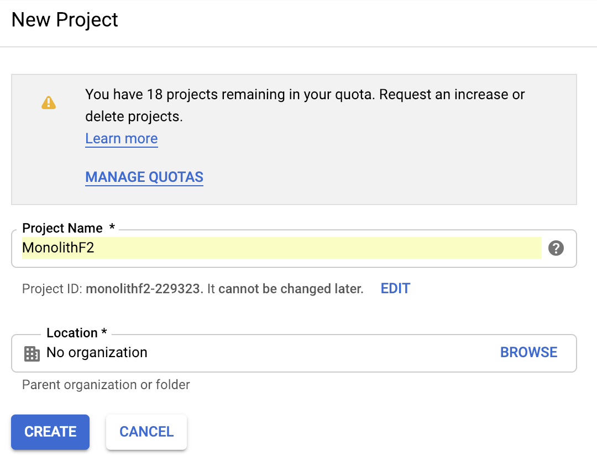
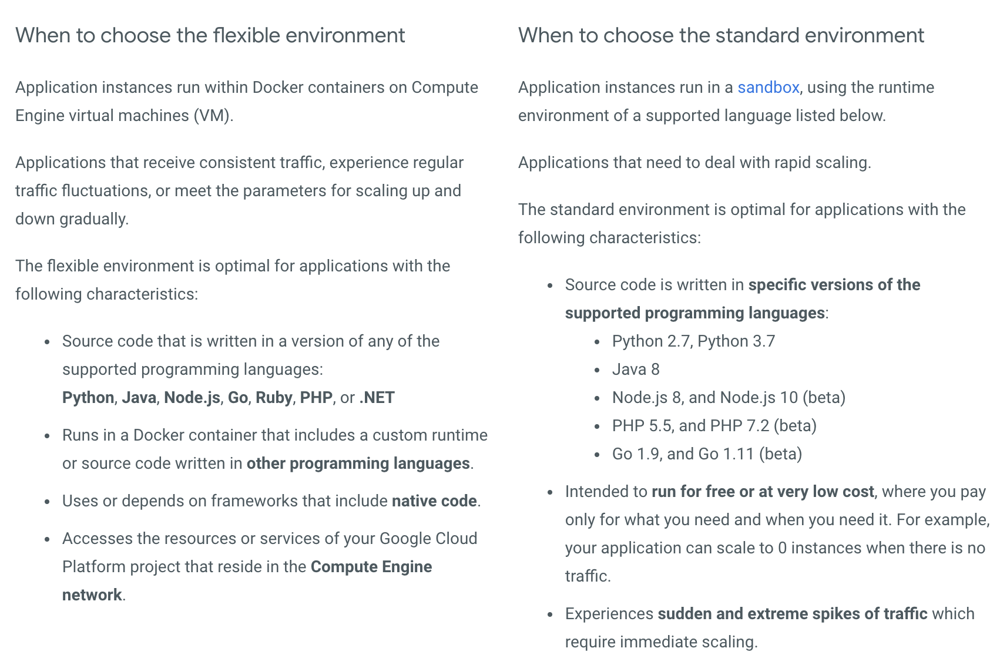
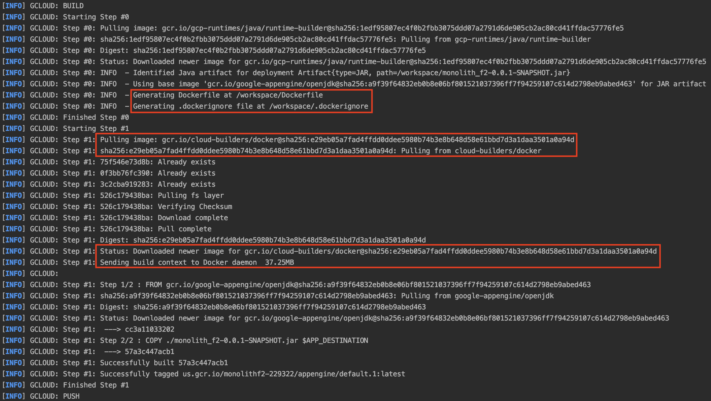
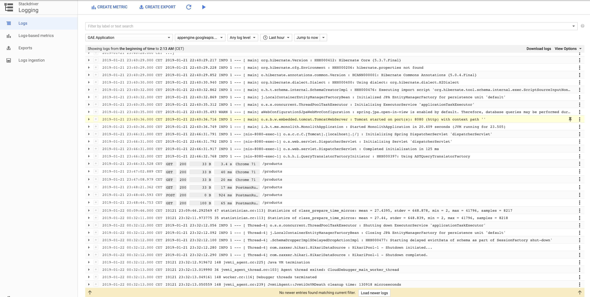

# Deployment the monolith from Day 2 to App Engine

## Pre-setup

You cannot continue the following steps without having the GCP SDK properly configured. So if until now you still hadn't paired your Google account with GCP, make sure to run one of the following commands to do so.

```sh
gcloud init 

OR 

gcloud init --console-only
```

You will either login in the browser window opened by the wizard (on Windows) or type in second command and follow the link provided there which will take you to a login page and if you are verififed succesfully, you get a code to enter into the console.

## 1. Setup and requirements

Sign-in to Google Cloud Platform console (console.cloud.google.com) and create a new project (tip: you can also create a project from the command line).

You can go to this [page](https://console.cloud.google.com/cloud-resource-manager), where you will find a list of all of your projects.

Above the list of your projects you will find a __Create Project__ option so make sure to select that.



You will end up with a form where you can input the name of your new project. After filling in the name of your new project, under the input form, you will see a generate identifier. Remember the project ID, a unique name across all Google Cloud projects. It will be referred to later in this tutorial as `PROJECT_ID`.

__Note:__ A good observation is that there is a quota on the number of projects you can create (+-20, more info here), but once you reach that quota, you can easily ask to increase this limit.



Next, you'll need to enable billing in the Cloud Console in order to use Google Cloud resources, if this is not already turned on by default.

Run the following command in the terminal to confirm that you are authenticated:

```sh
gcloud auth list
```

__Command output__

```sh
Credentialed accounts:
 - <myaccount>@<mydomain>.com (active)
```

 __Note:__ `gcloud` is the powerful and unified command-line tool for Google Cloud Platform. Full documentation is available from https://cloud.google.com/sdk/gcloud.

Then you need to make sure that your project is good to go, so you can run:

```sh
gcloud config list project
```

__Command output__

```sh
[core]
project = <PROJECT_ID>
```


If it is not, you can set it with this command:

```sh
gcloud config set project <PROJECT_ID>
```

__Command output__

```sh
Updated property [core/project].
```

## 2. Update Maven `pom.xml` 

There are multiple ways to deploy a Java server application - either by using a Maven or Gradle plugin, or by deploying the war package directory. In the example, we'll use Maven to deploy the application.

#### Add App Engine Plugin
Update the pom.xml to include a Google Cloud Platform plugin that simplifies the deployment process.

**pom.xml**
```xml
<?xml version="1.0" encoding="UTF-8"?>
<project xmlns="http://maven.apache.org/POM/4.0.0" ...>
  ...
  <build>
    <plugins>
      ...
      <plugin>
        <groupId>com.google.cloud.tools</groupId>
        <artifactId>appengine-maven-plugin</artifactId>
        <version>1.3.2</version>
        <configuration>
          <version>1</version>
        </configuration>
      </plugin>
      ...
    </plugins>
  </build>
</project>
```

## 3. Add App Engine `app.yaml` file

To deploy the application into App Engine flex environment, you must add create a new src/main/appengine/app.yaml file, so make sure you create an `appengine` directory inside `main` directory, and inside `appengine` create an `app.yaml` file. 

Then, in this file, copy the following content:

```yaml
service: monolith # Id of the service
env: flex         # Flex environment
runtime: java     # Java runtime
runtime_config:
  jdk: openjdk8   # use OpenJDK 8
```

## 4. Deploying the Application into App Engine

First, initialize the Project to be able to run App Engine applications. We'll initialize the project to run in the Europe region (more specifically, London):

```sh
$ gcloud app create --region europe-west2

You are creating an app for project [...].
WARNING: Creating an App Engine application for a project is irreversible and the region
cannot be changed. More information about regions is at
https://cloud.google.com/appengine/docs/locations
```

__Note:__ You can alternatively list all available regions `gcloud app regions list` and pick another one if you want to.

Then, deploy your application into App Engine environment, run:

```sh
$ ./mvnw -DskipTests appengine:deploy
```

__Note:__ If after this step you get any errors regarding the deployment stage, you may also try to deploy using the `gcloud` tool itself, with the command:

```sh
gcloud app deploy <your-path-to-app.yaml-file>
```

First time deployment may take several minutes. This is because App Engine Flexible environment will automatically provision a Google Compute Engine virtual machine for you behind the scenes, and then installing the application, and starting it.

After the application is deployed, you can visit it by opening the URL http://<project-id>.appspot.com in your web browser.

## 5. Congratulations!

You just learned how to write your first App Engine web application by deploying your monolith.

## Useful Information


### App Engine Flexible Environment
App Engine allows developers to focus on doing what they do best, writing code. Based on Google Compute Engine, the App Engine flexible environment automatically scales your app up and down while balancing the load. 

Microservices, authorization, SQL and NoSQL databases, traffic splitting, logging, versioning, security scanning, and content delivery networks are all supported natively. In addition, the App Engine flexible environment allows you to customize the runtime and even the operating system of your virtual machine using Dockerfiles.

#### When to use the standard environment or the flexible environment

You can run your applications in App Engine using the flexible environment or standard environment. You can also choose to simultaneously use both environments for your application and allow your services to take advantage of each environment's individual benefits.



More information on this you can be found [here](https://cloud.google.com/appengine/docs/the-appengine-environments).


Now, because we used the flex environment, makes sense why the application took so much time to deploy. And of course, if we look at the logs that resulted in the operation of deploying, you can see that indeed, our monolith application has been containerized inside a Docker image and that container image is the actual thing that we are deploying.

If you look at the picture below, you can see an example of such a log.



Now, one way of looking at the logs is either locally, in the console of the IDE that you are using to deploy the application or on the web console of Google Cloud Platform.

In order to access these logs, you can go to the GCP console and search for `Logging`. As you can see in the picture below, there is a lot of information regarding the status of our application and we even get to see information about the requests that the application received as well as information about the clients that sent those requests.




