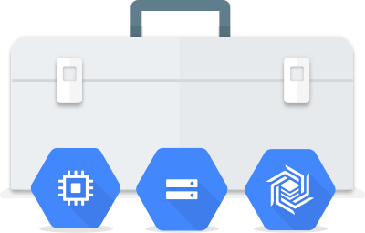

# Installing the SDK for Google Cloud Platform

### The Cloud SDK
The Cloud SDK is a set of tools for Cloud Platform. It contains gcloud, gsutil, and bq, which you can use to access Google Compute Engine, Google Cloud Storage, Google BigQuery, and other products and services from the command-line. You can run these tools interactively or in your automated scripts.

To install this tool, please head to [this](https://cloud.google.com/sdk/docs/quickstarts) page and follow the steps along from there to install the tool, according to the OS that you may have on your machine.

After installing, let's make sure that you have everything the setup ready, so let's run a few commands in the CLI to test that.

```sh
gcloud --version
```

__Command output__
```sh
Google Cloud SDK 230.0.0
app-engine-java 1.9.71
app-engine-python 1.9.81
bq 2.0.39
cloud-datastore-emulator 2.0.3
core 2019.01.11
gsutil 4.35
```

```sh
gcloud auth list
```

__Command output__ (gcloud displays a list of credentialed accounts)

```sh
        Credentialed Accounts
ACTIVE             ACCOUNT
*                  example-user-1@gmail.com
                   example-user-2@gmail.com
```


The `gcloud` command-line tool is downloaded along with the Cloud SDK; a comprehensive guide to gcloud can be found in [gcloud Overview](https://cloud.google.com/sdk/gcloud/).

gcloud is a tool that provides the primary command-line interface to Google Cloud Platform. You can use this tool to perform many common platform tasks either from the command-line or in scripts and other automations.

For example, you can use `gcloud` to create and manage:

* Google Compute Engine virtual machine instances and other resources
* Google Cloud SQL instances
* Google Kubernetes Engine clusters
* Google Cloud Dataproc clusters and jobs
* Google Cloud DNS managed zones and record sets
* Google Cloud Deployment manager deployments

You can also use `gcloud` to deploy App Engine applications and perform other tasks. The complete list of the capabilities of this tool can be found on the [gcloud reference](https://cloud.google.com/sdk/gcloud/reference/).

### Running gcloud commands
You can run gcloud commands from the command line in the same way you use other command-line tools. You can also run gcloud commands from within scripts and other automations, for example, when using Jenkins to automate Cloud Platform tasks.